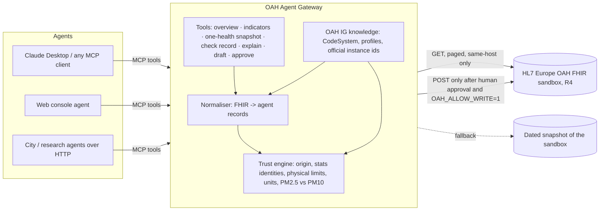

# 💧 OAH Agent Gateway

**Trusted, standards-based access to OneAquaHealth One Health data for AI agents.**

IEEE OneAquaHealth Global Hackathon 2026 · **Track 7: Digital Health Standards** (FHIR models, AI agents, integration frameworks)

> From streams to systems: any AI agent, in any city health department, research lab or citizen app, can query OneAquaHealth water, air and population-health data through one standard interface, and is told which numbers it may trust.

---

## The problem

OneAquaHealth publishes water quality, air quality and population-health indicators as **HL7 FHIR R4** following the **OAH Implementation Guide**, so environmental and human health can be studied together. Two gaps remain:

1. **AI agents can't use it safely.** Researchers and city staff increasingly ask AI assistants instead of writing FHIR queries. An agent pointed at a FHIR server sees resources, not meaning: it doesn't know which records are official, which values are physically impossible, or what an OAH code means.
2. **FHIR-valid is not the same as true.** In the official sandbox, `Observation/Obs-Almyros-TemperatureWater-2013` reports an annual mean water temperature of **198,000 °C** (median 19.8 °C). It passes FHIR validation. An agent would happily report it. In total, **120 of the 385 official observations** fail basic integrity checks, and the shared sandbox also contains 65 observations written by third parties that are not part of the official dataset.

## The solution

The **OAH Agent Gateway** is a [Model Context Protocol](https://modelcontextprotocol.io) server (plus a web console) that sits between AI agents and the OAH FHIR sandbox:

| What agents get | How |
|---|---|
| **One standard interface** for any MCP-capable agent (Claude, IDE agents, custom agents) | 8 MCP tools over stdio or HTTP |
| **A trust verdict on every value**: `OK`, `CAUTION` or `DO_NOT_USE`, with reasons | Deterministic checks: origin, statistical identities, physical limits, units, cross-record consistency |
| **Traceability**: every number carries its `fhir_ref` | Agents are instructed to cite it |
| **Meaning**: official IG definitions for every indicator code | Parsed from the OAH CodeSystem (`hl7-eu/oah`) |
| **One Health in one call**: water + air + population health for a city, with WHO/EU context and evidence limits | `one_health_snapshot(city)` |
| **Human-approved write-back**: citizen reports become IG-conformant `ObservationIndicatorsOah` + `Provenance` (citizen = author, AI = assembler) | Nothing is written without explicit human confirmation |

AI never decides a trust verdict. The checks are deterministic code; the language model only reads the results and writes the answer.

## Architecture



## What it finds in the official data

From the sandbox snapshot of 2026-09-30 (reproduce with `pytest`):

- **450 observations**, 385 official (IG example instances), 65 written by third parties.
- **120 DO_NOT_USE**: all in the Crete (Almyros/Giofyros) water-chemistry summaries. Average, minimum and maximum are often exactly 10⁴ × the median (e.g. pH average 75,900, median 7.59), consistent with a lost decimal separator during conversion. The gateway labels this a hypothesis, never corrects it.
- **210 CAUTION**: usable with a stated caveat. Mostly community-health indicators whose IG definition says 'per 100,000 inhabitants' while values are published in %, plus records written to the shared sandbox by third parties and PM2.5 > PM10 pairs.
- **PM2.5 above PM10** for the same Benevento site and year (impossible, since PM2.5 is part of PM10): flagged `CAUTION` on both records.
- **Health indicators** are defined in the IG as cases per 100,000 inhabitants but published in %: flagged `CAUTION` with a reading note.
- Benevento air quality 2019: NO₂, PM10 and PM2.5 annual means are above the WHO 2021 guideline at nearly every monitoring site. A clear One Health signal an agent can now report with sources.

## MCP tools

| Tool | Purpose |
|---|---|
| `data_overview()` | Cities, domains, counts, source (live/snapshot), trust summary |
| `list_indicators(city?, domain?)` | Indicators available, with periods and trust counts |
| `get_indicator(city, code)` | Every value with stats, unit, FHIR reference, WHO/EU context, trust verdict |
| `one_health_snapshot(city)` | Latest safe water/air/health values, values above reference, excluded records, evidence limits |
| `check_record(observation_id)` | Full integrity report for one Observation |
| `explain_indicator(code)` | Official OAH IG definition |
| `draft_citizen_observation(...)` | Citizen report -> draft `ObservationIndicatorsOah` + `Provenance` |
| `approve_draft(draft_id, confirmed_by_human)` | Records the draft only after explicit human confirmation |

## Quick start

Requires Python 3.10+.

```bash
pip install -r requirements.txt
pytest -q                                   # 14 tests, offline
streamlit run app.py                        # web console (http://localhost:8501)
python -m oah_gateway.server                # MCP server over stdio
python -m oah_gateway.server --http         # MCP over HTTP at http://localhost:8765/mcp
```

Environment variables:

| Variable | Default | Meaning |
|---|---|---|
| `OAH_FHIR_BASE` | `https://sandbox.hl7europe.eu/oneaquahealth/fhir` | FHIR server implementing the OAH IG to read from (and write to, if enabled) |
| `OAH_SOURCE` | `auto` | `live` (sandbox), `snapshot` (bundled copy) or `auto` (live, fall back to snapshot) |
| `NVIDIA_API_KEY` | – | From [build.nvidia.com](https://build.nvidia.com); enables the chat agent in the web console |
| `NVIDIA_MODEL` | `nvidia/nemotron-3-super-120b-a12b` | Model for the console agent (NVIDIA API; reasoning disabled for fast demos) |
| `NVIDIA_BASE_URL` | `https://integrate.api.nvidia.com/v1` | NVIDIA OpenAI-compatible endpoint |
| `ANTHROPIC_API_KEY` | – | Fallback provider for the chat agent, used when `NVIDIA_API_KEY` is not set |
| `OAH_AGENT_MODEL` | `claude-sonnet-5-5` | Anthropic model for the console agent |
| `OAH_ALLOW_WRITE` | off | Set to `1` to allow approved drafts to be POSTed to the sandbox |

For reproducible hackathon demos, set `OAH_SOURCE=snapshot`; the public sandbox is shared, so live observation counts can grow. Live and `auto` modes remain available.
Local settings are loaded from `.env` through `python-dotenv`; copy `.env.example` and keep the real file untracked.

### Connect Claude Desktop

Add to `claude_desktop_config.json` (see `examples/claude_desktop_config.json`):

```json
{
  "mcpServers": {
    "oah-gateway": {
      "command": "python",
      "args": ["-m", "oah_gateway.server"],
      "cwd": "/absolute/path/to/oah-agent-gateway"
    }
  }
}
```

Then ask: *"Give me a One Health summary for Benevento"* or *"Is the Almyros river water chemistry reliable?"*

## Trust rules

| Family | Rule | Verdict |
|---|---|---|
| Origin | Not an official OAH IG instance (written to the shared sandbox by a third party) | CAUTION |
| Statistics | min > max; median or average outside [min, max]; negative SD; average/median ratio ≥ 100 | DO_NOT_USE |
| Physical | Water temperature outside −2…45 °C; pH outside 0–14; % outside 0–100; negative concentration | DO_NOT_USE |
| Units | Numeric measurement without a UCUM unit; IG definition unit ≠ published unit | CAUTION |
| Cross-record | PM2.5 > PM10 at the same site and period | CAUTION |

Comparisons use a tolerance of half a unit of the least precise published decimal, so rounding alone never fails a check. WHO/EU reference values are shown for context only and are never presented as legal limits for surface water.

## Standards used

- HL7 FHIR R4 (4.0.1); OneAquaHealth FHIR IG (`hl7-eu/oah`, commit `b907cf08`): `LocationOah`, `ObservationIndicatorsOah`, `ObservationHealthMeasureOah`, `GroupOah`, `TemporaryOahSystem`
- FHIR `Provenance` with participant types `author` (citizen) and `assembler` (AI)
- The citizen write-back transaction Bundle is validated in the test suite with fhir.resources R4B models, which are structurally identical to R4 for Observation, Provenance and Bundle
- `observation-statistics` CodeSystem, UCUM units
- Model Context Protocol (MCP) for agent interoperability

## Why this scales

- **Any FHIR server**: point `OAH_FHIR_BASE` at another city's or lab's server implementing the OAH IG.
- **Any agent**: MCP is supported by a growing number of AI clients, so one gateway serves all of them.
- **Standards both ways**: reads and writes the same IG profiles, so citizen data flows into the same systems as lab and health data.
- **Integrates with existing tools**: the OAH Citizen Science App, city dashboards or EHR-side systems can consume the same FHIR resources.

## Limitations

- Trust verdicts prove that published values can't all be right; they don't say which value is wrong or why.
- Population-health indicators are aggregated by cohort: they support co-occurrence, never causation. The gateway says so in every One Health response.
- The live sandbox is shared and writable, so live results can change; the snapshot makes results reproducible.
- City assignment of locations follows the IG example identifiers (Crete, Benevento, Oslo).

## Data, attribution and licence

- Data: OneAquaHealth FHIR sandbox, operated by HL7 Europe. Definitions: OneAquaHealth FHIR IG ([hl7-eu/oah](https://github.com/hl7-eu/oah)). OneAquaHealth is funded by the European Union's Horizon Europe programme.
- The bundled snapshot (`data/snapshot/`, retrieved 2026-09-30) is the sha256-verified copy published by [OAH Data Doctor](https://github.com/Unknown1502/OAH-Data-Doctor); the hackathon organizers confirmed on the Devpost discussion board that sandbox data may be included in public repositories. Snapshot data is credited to the OneAquaHealth project and HL7 Europe and is not covered by this repository's licence.
- Code: MIT (see `LICENSE`).


